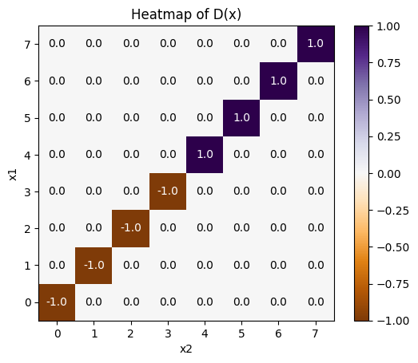
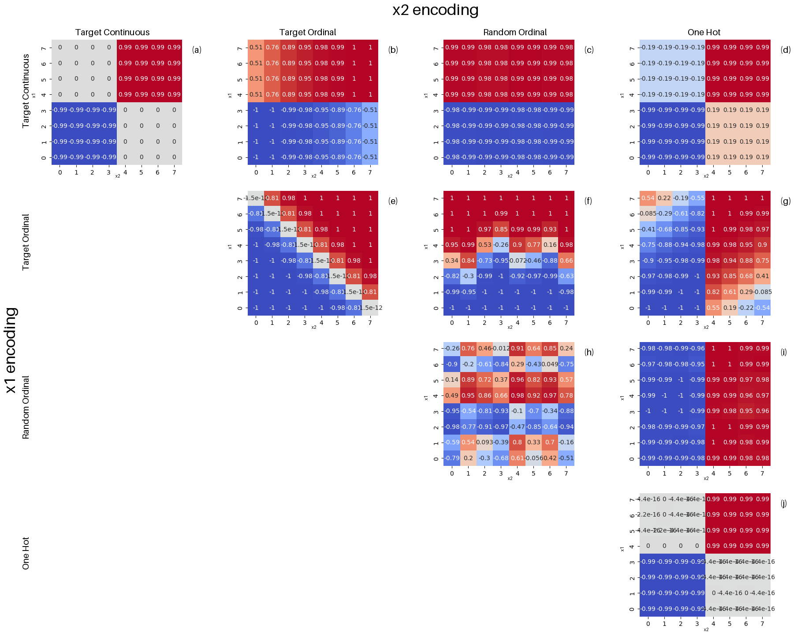
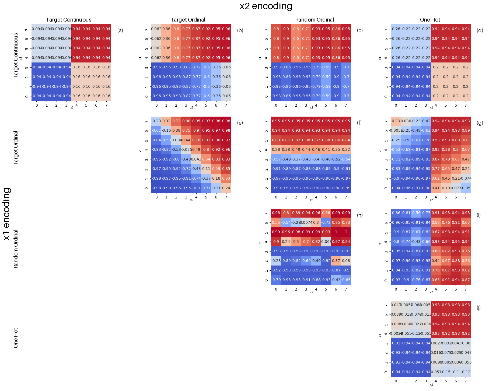
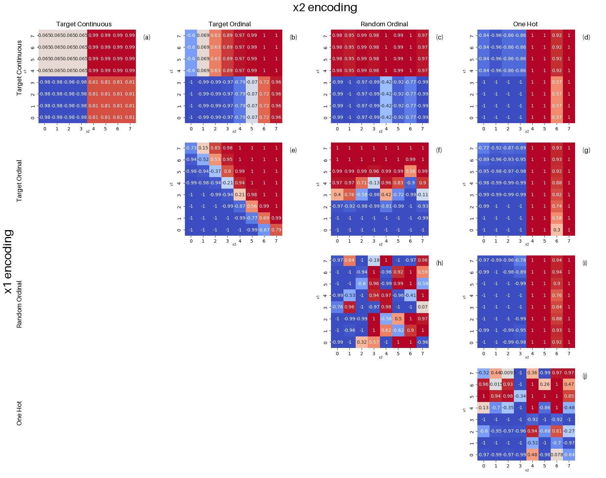
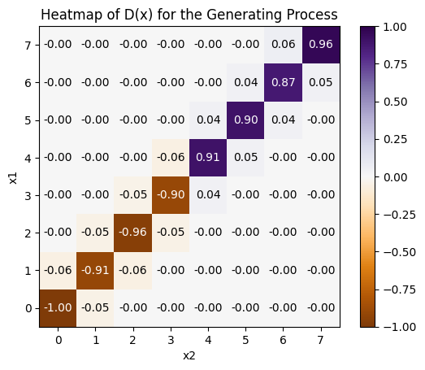

# Metric Calculation

The method uses out-of-domain test samples uniformly sampled among input-groups. For domains including a relatively modest number of input-groups (e.g. 2 variables times 8 levels yield 64 input-groups), we use one representative of each input-group as out-of-domain test set.

We compute $\hat{P}(y|x)$ (reference predictions) and $\hat{P}_i(y|x)$ obtained by "neutralizing" the effect of variable $x_i$ by randomly permuting values assigned to $x_i$. Then we compute  $mean(abs(\hat{P}(y|x)-\hat{P}_i(y|x)))$, where the mean runs over all out-of-domain test samples, to measure the difference between predictions. We then average over multiple random permutations of assignment of values to $x_i$ to eliminate the chance factor and approximate the expected value to get $c_i=E(mean(abs(\hat{P}(y|x)-\hat{P}_i(y|x))))$.

In our numerical experiments, to simplify, we focus on only two variables $x_1$ and $x_2$ and encode them with one of several encoding methods (\eg, label encoding, target encoding, one-hot encoding). We fix the model used to obtain $\hat{P}(y|x)$ (\eg, a RBF SVM, a linear model, a neural network, or a Random Forest, with default parameter settings). For each combination of encoding, we evaluate the relative predictive importance of the two variables under study $R=c_1/c_2$, where $c_i$ is the predictive variable importance obtained by a permutation method described above. The relative predictive importance $R$ is usually influenced both by the statistical dependency between $x_1$,  $x_2$ and $y$ and by the "availability" of variables $x_1$ and $x_2$ to the given model. By "availability", we mean the ease with which the model exploits $x_1$ or $x_2$ to make predictions, which depends on variable encoding. Let us call $e_i$ the encodings of variables $x_1$ and  $x_2$ ($e_i\in$ {target encoding, target ordinal encoding, random ordinal encoding, one-hot encoding}). We compute $R(e_i, e_j)$ for each pair of encodings, $e_i$ encoding variable $x_1$ and $e_i$ variable $x_2$. We then compare values. 

Our first synthetic example has identical variables $x_1 = x_2$ and therefore both statistically dependent upon $y$. Hence $R$ solely depends on variable availability. If both variables are similarly encoded, we expect that $R(e_i, e_i)=1$. If $R(e_i, e_j)>1$ then it means the choice of encoding favors variable $x_1$ over $x_2$ while if $R(e_i, e_j)<1$, $x_2$ is favored over  $x_1$. In either case, $R(e_i, e_j)\neq 1$ indicates bias introduced by coding.

In the second synthetic example we consider the following data generating process: Draw $x_2 \in [0, 7]$, draw $x_1 = x_2  + \epsilon$, where $\epsilon$ is drawn according to a Normal distribution with standard deviation $\sigma=0.3$. Give value $y=0$ to points with value $x_2<4$ and $y=1$ otherwise. The causal graph is [ $x_1 = x_2  + \epsilon$] <- [$x_2$] ->    [$y=0$ if $x_2<4$; else $y=1$]
The relationship between $y$ and $x_2$ is deterministic, but that between $x_1$ and $x_2$ is noisy. $x_2$ is more predictive of $y$. Thus it seems natural that generalization according to $x_2$ would be privileged. Thus we should expect $R(e_i, e_j)<1$, that $x_2$ is favored.

In real data, the two variables are not identically dependent upon $y$. Hence $R(e_i, e_i)\neq 1$. The bias introduced by coding is revealed by the discrepancy between $R(e_i, e_i)$ and $R(e_i, e_j)$, $j\neq i$.

# Synthetic Data

## Symmetric Features

### Dataset

Shows the plot of $D(x) = ( P(y=1|x) - P(y=0|x) ) p(x) / p_{max}  =  (2 P(y=1|x) -1) p(x) / p_{max}$. This dataset has identical $x_1$ and $x_2$ features such that $x_1 = x_2 = y$. A fair classifier should not prefer one feature other the other in predicting $y$.
Each feature has 8 possible values, numbered 0 to 7. The training data distribution is concentrated on diagonal locations in input space: $y=0: \mathbf{x} \in \{(0,0),(1,1),(2,2),(3,3)\}$; $y=1: \mathbf{x} \in \{(4,4),(5,5),(6,6),(7,7)\}$. Hence, generalization outside of such input space locations are guided by encoding bias. The dataset used in the following tests contains 1000 data points.

### Logistic Regression, Default Parameters

Classifier predictions  $2 P(y=1|\mathbf{x})-1$ are presented for *test data*. Each heatmap corresponds to a different combination of encoding of the two features $x_1$ and $x_2$. Heatmaps (a) (target encoding for both variables) and (j) (one-hot encoding for both variables)  presents an intuitive out-of-domain generalization (possibly acceptable, depending on the application domain):  $P(y=1|\mathbf{x})=0$, if $x_1 \leq 3,  x_2 \leq 3$, $P(y=1|\mathbf{x})=1$, if $x_1 > 3, x_2 >3$, $P(y=1|\mathbf{x})=0.5$ otherwise. This is the least biased case as this makes the least out-of-domain assumptions compared to others. Case (h) results in arbitrary generalization, governed by a random ordering of variable values. The off-diagonal cases are revealing of the asymmetry introduced by encoding, which facilitates generalizing along one of the dimensions. In particular, the heatmaps of the last column (d), (g), and (i), clearly show that one-hot encoding facilitates generalization. Hence, if one variable uses one-hot encoding (here $x_2$) and the other uses another encoding, then generalization is driven by the one-hot encoded variable: $P(y=1|\mathbf{x})<0.5$, if $x_2 \leq 3$, $P(y=1|\mathbf{x})>0.5$, if $x_2 >3$. While one-hot encoding "dominates" all other encodings, it does not strongly dominate target continuous encoding. Furthermore target continuous encoding dominates target-ordinal and random-ordinal and target-ordinal dominates random-ordinal. So, while encoding with on-hot encoding may seem preferable (because least biased), target encoding presents a good alternative, if one-hot encoding is not viable because of problems of curse-of-dimensionality.

$R(e_1,e_2)$:
|                         | TargetContinuous:x2 | TargetOrdinal:x2 | RandomOrdinal:x2 | OneHot:x2 |
| :---------------------- | :--------------- | :---------------------- | :---------------------- | :--------------- |
| TargetContinuous:x1        | -0.032181        | -1.76737                | -5.07958                | 0.362936         |
| TargetOrdinal:x1 | 1.74079          | -0.00151107             | -1.64611                | 0.879471         |
| RandomOrdinal:x1 | 6.02127          | 2.066                   | -0.561533               | 4.73425          |
| OneHot:x1        | -0.427298        | -0.907887               | -4.04687                | -0.032181        |

The quantitative results of $R(e_1,e_2)$ align visually with which feature is "dominating" the other. We can see that when random-ordinal encoding is used, the other feature always dominates. This is reflected by the negative values in the column for $x_2$ and the positive values in the row for $x_1$. We can also see that one-hot encoding dominates all other encoding types reflected by its positive column for $x_2$ and negative row for $x_1$. We also notice that the diagonal is close to zero where the encoding type is not random-ordinal encoding. A value of zero indicates no preference of variables. The non-zero value for $e_1,e_2 =$ random-ordinal encoding results from the models inability to fit the training data resulting in a randomized preference. 

### Neural Network, $\alpha = 10$

Classifier predictions  $2 P(y=1|\mathbf{x})-1$ are presented for *test data*. Heatmap (j) is the least biased where the model as the model does not prefer one variable over the other. The results show that generalizations utilizing random-ordinal encoding are the most the biased, having a clear preference for the feature encoded using the alternate strategy. An artifact of ordinal encoding appears in cases (b) and (g). The nature of ordinal encoding is such that each successive level increases the input by 1. Thus for (b), horizontally there is a gradient where $x_2=0$ has the lowest $2 P(y=1|\mathbf{x})-1$ value for $x_1 > 4$ and the highest values for $x_2=7$ and $x_1 < 4$. Additionally for (g) and (f), vertically there is a gradient. For (g), the graident is most visible for $x_2=0$ and $x_2 = 7$. This effect is also seen in case (e), however, since both features are encoded ordinally the gradient is diagonal. In all of the off diagonal heatmaps there are preferences towards one feature. One-hot encoding dominates all of its off diagonal pairs target-ordinal encoding dominates all that are not one-hot encoding and target-ordinal encoding dominates random-ordinal.

$R(e_1,e_2)$:

|                         | TargetContinuous:x2 | TargetOrdinal:x2 | RandomOrdinal:x2 | OneHot:x2 |
| :---------------------- | :--------------- | :---------------------- | :---------------------- | :--------------- |
| TargetContinuous:x1        | 0.24091          | -0.779869               | -3.80423                | 0.44286          |
| TargetOrdinal:x1 | 1.08786          | 0.195335                | -0.484428               | 0.791486         |
| RandomOrdinal:x1 | 4.92722          | 2.30064                 | 0.193524                | 2.84085          |
| OneHot:x1        | -0.387975        | -0.792507               | -3.33748                | -0.0717689       |

The quantitative results of $R(e_1,e_2)$ show align visually with which feature is "dominating" the other. We can see that when RandomOrdinalEncoding is used, the other feature always dominates. Thi sis reflected by the negative values in the column for $x_2$ and the positive values in the row for $x_1$. We can also see that OneHot dominates all other encoding types reflected by its positive column for $x_2$ and negative row for $x_1$. We also notice that the diagonal is close to zero where the encoding type is not RandomOrdinalEncoding. A value of zero indicates no preference of variables. The non-zero value for $e_1,e_2 =$ RandomOrdinalEncoding results from the models inability to fit the training data resulting in a randomized preference. 

### Neural Network, No regularization

Here we once agin show the classifier predictions  $2 P(y=1|\mathbf{x})-1$ for *test data*. Heatmaps (d), (g), (i) 

$R(e_1,e_2)$:
|                         | TargetContinuous:x2 | TargetOrdinal:x2 | RandomOrdinal:x2 | OneHot:x2 |
| :---------------------- | :--------------- | :---------------------- | :---------------------- | :--------------- |
| TargetContinuous:x1        | 0.764156         | 0.247328                | -4.57222                | 2.90733          |
| TargetOrdinal:x1 | 0.922938         | 0.370938                | -0.641183               | 2.99676          |
| RandomOrdinal:x1 | 6.08493          | 1.04696                 | -0.844642               | 6.46482          |
| OneHot:x1        | -1.67252         | -0.808272               | -5.67367                | -0.156863        |

## Asymmetric Features

### Dataset

Data Generation Process: Draw $x_2 \in [0, 7]$, draw $x_1 = x_2  + \epsilon$, where $\epsilon$ is drawn according to a Normal distribution with standard deviation $\sigma=0.3$. Give value $y=0$ to points with value $x_2<4$ and $y=1$ otherwise. The causal graph is [ $x_1 = x_2  + \epsilon$] <- [$x_2$] ->    [$y=0$ if $x_2<4$; else $y=1$]. 10000 points are sampled to generate the dataset.

The relationship between $y$ and $x_2$ is deterministic, but that between $x_1$ and $x_2$ is noisy. $x_2$ is more predictive of $y$. Thus it seems natural that generalization according to $x_2$ would be privileged. 

### Logistic Regression, High L1

# Real Data

## Adult Income Dataset
The Adult dataset, which contains features such as race and education, is used to study the impact of encoding choices in a real-world scenario. Features are preprocessed and encoded using Target Encoding, Target Ordinal Encoding, Ordinal Encoding, and One-Hot Encoding. The model is trained on the preprocessed data, and the performance of different encoding strategies is evaluated using mean squared differences and ratios, similar to the synthetic example.

### Neural Network
Hidden Layers: \[5,5\], $\alpha=1$

$R(e_1,e_2)$:

|                           | TargetContinuous:education | TargetOrdinal:education | OrdinalEncoder:education | OneHot:education |
| :------------------------ | :---------------------- | :----------------------------- | :----------------------- | :---------------------- |
| TargetContinuous:race        | 1.80761                 | 0.378853                       | 0.288799                 | 1.69363                 |
| TargetOrdinal:race | 1.94494                 | 0.606847                       | 0.597614                 | 1.87873                 |
| OrdinalEncoder:race       | 1.74858                 | 0.575731                       | 0.448224                 | 1.68562                 |
| OneHot:race        | 1.64214                 | 0.373556                       | 0.317833                 | 1.81385                 |

Balanced Accuracy:

|                           | TargetContinuous:education | TargetOrdinal:education | OrdinalEncoder:education | OneHot:education |
| :------------------------ | :---------------------- | :----------------------------- | :----------------------- | :---------------------- |
| TargetContinuous:race        | 0.584902                | 0.5                            | 0.5                      | 0.584902                |
| TargetOrdinal:race | 0.584754                | 0.5                            | 0.5                      | 0.584902                |
| OrdinalEncoder:race       | 0.580292                | 0.5                            | 0.5                      | 0.580292                |
| OneHot:race        | 0.584902                | 0.5                            | 0.5                      | 0.580441                |

### Neural Net - Feature Sets

|                | OneHot:f1 | TargetContinuous:f1 | OrdinalEncoder:f1 |
|----------------|------------------|------------------|-------------------|
| OneHot:f2 | 0.714410         | 0.739437         | 0.199159          |
| TargetContinuous:f2 | 1.518820         | 1.101716         | 0.688299          |
| OrdinalEncoder:f2 | 1.742374         | 1.233398         | 1.076349          |

## Cook County 

### Logistic Regression, Default

$R(e_1,e_2)$:

|                           | TargetContinuous:COMMITMENT_TYPE | TargetOrdinal:COMMITMENT_TYPE | OrdinalEncoder:COMMITMENT_TYPE | OneHot:COMMITMENT_TYPE |
| :------------------------ | :---------------------------- | :----------------------------------- | :----------------------------- | :---------------------------- |
| TargetContinuous:RACE        | 0.996685                      | 0.996612                             | 0.982144                       | 0.996685                      |
| TargetOrdinal:RACE | 0.996685                      | 0.996612                             | 0.982144                       | 0.996685                      |
| OrdinalEncoder:RACE       | 0.996685                      | 0.996612                             | 0.981992                       | 0.996685                      |
| OneHot:RACE        | 0.996685                      | 0.996612                             | 0.982107                       | 0.996685                      |
Balanced Accuracy:

|                           | TargetContinuous:COMMITMENT_TYPE | TargetOrdinal:COMMITMENT_TYPE | OrdinalEncoder:COMMITMENT_TYPE | OneHot:COMMITMENT_TYPE |
| :------------------------ | :---------------------------- | :----------------------------------- | :----------------------------- | :---------------------------- |
| TargetContinuous:RACE        | 3.617903                      | 2.144558                             | 2.118536                       | 2.958105                      |
| TargetOrdinal:RACE | 4.496680                      | 3.150707                             | 3.073897                       | 3.839763                      |
| OrdinalEncoder:RACE       | 3.818604                      | 2.525171                             | 2.370728                       | 3.174911                      |
| OneHot:RACE        | 3.055226                      | 1.509424                             | 1.274146                       | 2.819895                      |

# Neural Network
Hidden Layers: \[5,5\], Alpha=1

$R(e_1,e_2)$:

|                           | TargetContinuous:COMMITMENT_TYPE | TargetOrdinal:COMMITMENT_TYPE | OrdinalEncoder:COMMITMENT_TYPE | OneHot:COMMITMENT_TYPE |
| :------------------------ | :---------------------------- | :----------------------------------- | :----------------------------- | :---------------------------- |
| TargetContinuous:RACE        | 0.996685                      | 0.996612                             | 0.986852                       | 0.996876                      |
| TargetOrdinal:RACE | 0.996685                      | 0.996731                             | 0.986852                       | 0.996952                      |
| OrdinalEncoder:RACE       | 0.996685                      | 0.996764                             | 0.986852                       | 0.996647                      |
| OneHot:RACE        | 0.996685                      | 0.996688                             | 0.986701                       | 0.996647                      |
Balanced Accuracy:

|                           | TargetContinuous:COMMITMENT_TYPE | TargetOrdinal:COMMITMENT_TYPE | OrdinalEncoder:COMMITMENT_TYPE | OneHot:COMMITMENT_TYPE |
| :------------------------ | :---------------------------- | :----------------------------------- | :----------------------------- | :---------------------------- |
| TargetContinuous:RACE        | 3.985657                      | 2.267989                             | 7.196144                       | 3.614776                      |
| TargetOrdinal:RACE | 4.647600                      | 3.303791                             | 9.321657                       | 5.020746                      |
| OrdinalEncoder:RACE       | 3.735236                      | 2.547301                             | 7.212207                       | 3.195534                      |
| OneHot:RACE        | 3.283287                      | 2.449550                             | 0.525701                       | 2.913817                      |

<!--
## Encoded Spaces
## Random Ordinal
## Target Ordinal
## Target Encoding -->